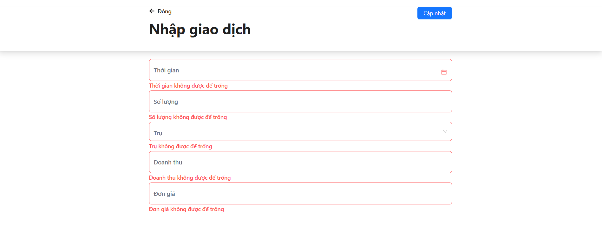

## Giới thiệu

-  Em chào anh/chị, và đây là bài test của vị trí FE (intern)
-  Em đã làm được task 1, 2, 4. Nếu em có thiếu sót gì mong anh/chị cho em thời gian, cơ hội để học thêm kiến thức mới em còn thiếu sót

## Task

#### Task 1

Công nghệ sử dụng:

-  ReactJs, Typescript
-  Tailwind
-  Antd design

#### Task 2

Công nghệ sử dụng:

-  ReactJs, Typescript
-  Tailwind
-  Antd design

#### Task 4

Em sử dụng thuật toán `Prefix Sum`
